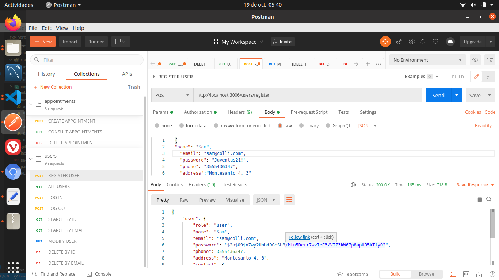
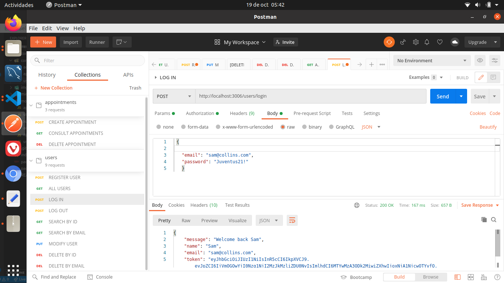
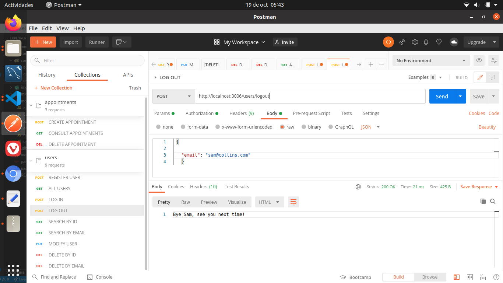
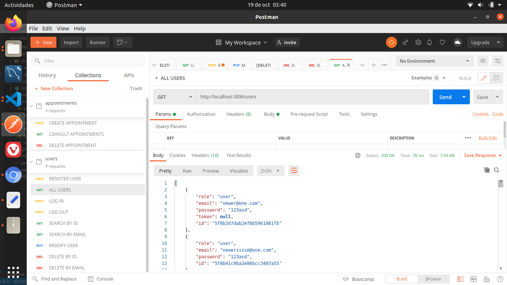
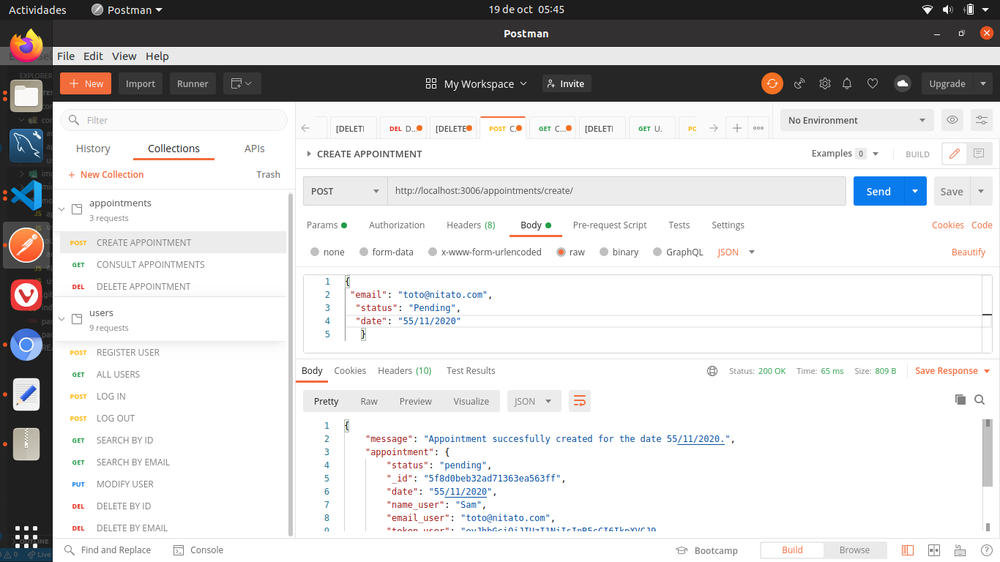
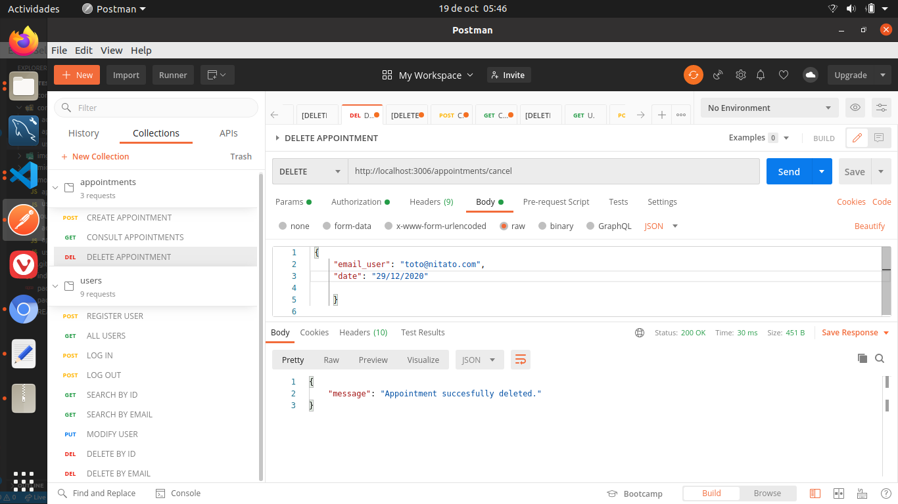

 # DentalClinicAppointments 

## What is DentalClinicAppointments ❓

### DentalClinicAppointments is, for now, the backend part of an application made for users of a dental clinic, where they can manage his appointments  📑

## 🔧🔧 Technologies:

- Javascript.
- NodeJS.
- Express.
- MongoDB.
- Mongoose.
- Mongo Atlas.
- Postman.
- Git.
- GitHub.
- Heroku.

## 👀 Dependencies:
- JWT.
- Bycrpt.
- RegEx.

# Getting Started

## Choose:

You can test the endpoints with the deployed app URL **(https://guarded-scrubland-93096.herokuapp.com)** or download the code, open it on vsCode and run in terminal:
 
   $ npm init -y 
   
   $ npm i express mongoose bcrypt jsonwebtoken 
   

## Important ❗

You will need to use Postman to make all the server petitions since we haven't a frontend yet.
Below there is a list of the endpoints you can reach:

# Users: 

-  https://guarded-scrubland-93096.herokuapp.com/users/register 🔛 **A new user is registered**  (POST method)

   Required parameters by body to register: "name", "email" and "password"

-  https://guarded-scrubland-93096.herokuapp.com/users/login 🔛 **User logs into his account**  (POST method)

   Required parameters by body to login: "name", "email"
   
-  https://guarded-scrubland-93096.herokuapp.com/users/logout 🔛 **User exits his acccount**  (POST method)

   Required parameters by body to logout: "name", "email"

-  https://guarded-scrubland-93096.herokuapp.com/users 🔛 **Show all users** (GET method)

-  https://guarded-scrubland-93096.herokuapp.com/users/:id 🔛 **Search a user by his id** (GET method)

-  https://guarded-scrubland-93096.herokuapp.com/users/email/:email 🔛 **Search a user by his email** (GET method)

-  https://guarded-scrubland-93096.herokuapp.com/users/:id 🔛 **Modify info of a user** (PUT method)

-  https://guarded-scrubland-93096.herokuapp.com/users/:id 🔛 **Delete a client by his id** (DELETE method)

- https://guarded-scrubland-93096.herokuapp.com/users/email/:email 🔛 **Delete a client by his id** (DELETE method) 

# Appointments: 

- https://guarded-scrubland-93096.herokuapp.com/appointments/show/INSERT-EMAIL-HERE 🔛 **Show appointments of user by date** (GET method)

  Required parameters by body: "date" // If you don't facilitate a date, all dates of user will be shown.

- https://guarded-scrubland-93096.herokuapp.com/appointments/create/INSERT-EMAIL-HERE 🔛 **User can make a new appointment** (POST method) 

  Required parameters by body: "date", "symptoms"

- https://guarded-scrubland-93096.herokuapp.com/appointments/cancel/INSERT-EMAIL-HERE 🔛 **User can cancel an appointment previously made** (DELETE method)

  Required parameters by body: "date" // If you don't facilitate a date, all dates of user will be shown

# Screenshots:

## SIGN UP
 
  
 
 ## LOG IN
 
   

## LOG OUT

  
  ## SHOW ALL USERS
  
  
 
 ## CREATE APPOINTMENT
 

## CHECK APPOINTMENTS

# DELETE APPOINTMENT 

