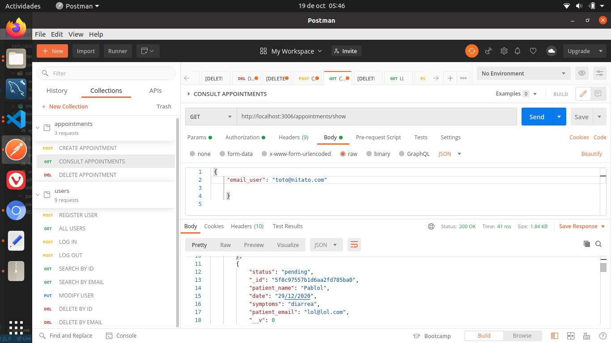

 # DentalClinicAppointments 

## What is DentalClinicAppointments ❓

DentalClinicAppointments is, for now, the backend part of an application made for users of a dental clinic, where they can manage his appointments ## 📑

🔧🔧 Technologies:

- Javascript.
- NodeJS.
- Express.
- MongoDB.
- Mongoose.
- Mongo Atlas.
- Postman.
- Git.
- GitHub.
- Heroku.

👀 Dependencies:
- JWT.
- Bycrpt.
- RegEx.

# Getting Started

## Choose:

You can test the endpoints with the deployed app URL (https://guarded-scrubland-93096.herokuapp.com) or download the code, open it on vsCode and run in terminal:
 
   $ npm init -y 
   
   $ npm i express mongoose bcrypt jsonwebtoken 
   

## Important ❗

You will need to use Postman to make all the server petitions since we haven't a frontend yet.
Below there is a list of the endpoints you can reach:

# Users: 

- POST https://guarded-scrubland-93096.herokuapp.com/users/register 🔛 A new user is registered
- POST https://guarded-scrubland-93096.herokuapp.com/users/login 🔛 User logs into his account.
- POST https://guarded-scrubland-93096.herokuapp.com/users/logout 🔛 User exits his acccount.

- GET https://guarded-scrubland-93096.herokuapp.com/users 🔛 Show all users.
- GET https://guarded-scrubland-93096.herokuapp.com/users/:id 🔛 Search a user by his id.
- GET https://guarded-scrubland-93096.herokuapp.com/users/email/:email 🔛 Search a user by his email

- PUT https://guarded-scrubland-93096.herokuapp.com/users/:id 🔛 Modify info of a user

- DELETE https://guarded-scrubland-93096.herokuapp.com/users/:id 🔛 Delete a client by his id.
- DELETE https://guarded-scrubland-93096.herokuapp.com/users/email/:email 🔛 Delete a client by his id.

# Appointments: 

- GET https://guarded-scrubland-93096.herokuapp.com/appointments/show/ 🔛 All appointments are shown.

- POST https://guarded-scrubland-93096.herokuapp.com/appointments/create/ 🔛 User can make a new appointment.

- DELETE https://guarded-scrubland-93096.herokuapp.com/appointments/cancel/🔛 User can cancel an appointment previously made.

# Screenshots:

## SIGN UP
 
  
 
 ## LOG IN
 
   

## LOG OUT

  
  ## SHOW ALL USERS
  
  
 
 ## CREATE APPOINTMENT
 

## CHECK APPOINTMENTS

# DELETE APPOINTMENT 
